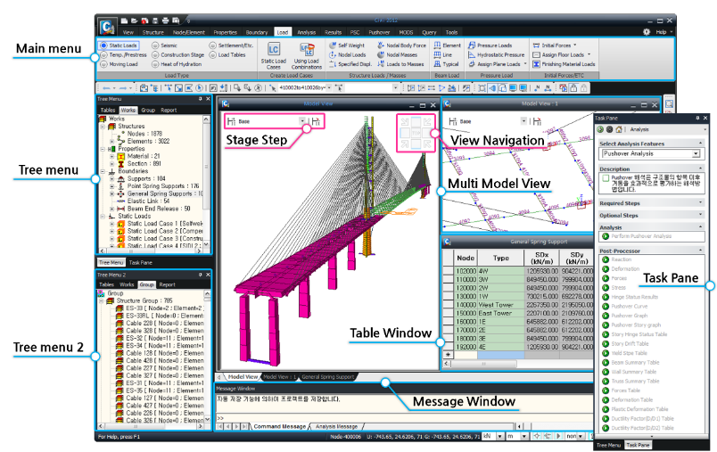
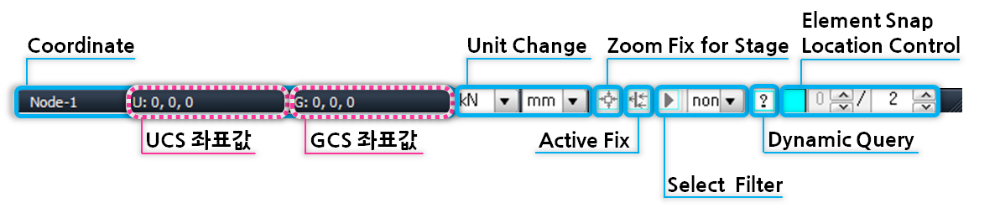

# Framework

#### 🎯 개요

* midas Civil에서는 Window 환경에 가장 최적화된 편리한 작업 환경을 제공할 수 있도록 다양한 메뉴 시스템, 작업화면과 함께 Tree Menu, Task Panel등의 작업 보조 윈도우, 사용자가 직접 구상할 수 있는 편리한 Toolbar 등을 제공합니다.

#### 🎯 화면구성

<figure><figcaption></figcaption></figure>

#### 🎯 상세설명

| Model Window    | midas Civil의 다양한 GUI 기능을 이용하여 모델링, 후처리 작업 등을 수행하는 작업 윈도우입니다. 모델 윈도우는 동시에 여러 개의 윈도우를 화면에 나타낼 수 있으며, 각 윈도우는 독립적으로 운용되기 때문에 각각 다른 사용자 좌표계를 부여하여 모델링 작업이 가능합니다. 또한, 각 윈도우는 동일 데이터베이스로부터 자료를 제공받기 때문에 한 윈도우 에서 작업한 내용이 다른 윈도우로 동시에 반영됩니다. 프로그램을 실행하면 Start Page(초기화면)가 MIDAS 홈페이지([http://midasuser.com/](http://midasuser.com/))로 연결됩니다.                                                                                                                                                                                                                                                                                                                                                                                                                                                                                                                                                                                                                                                                                                                                                                                                                                                                                                                                                                                                                                                                                                                                                                                                                                                                                                                                                                                                                                                                                                                                                                                                                                                                                                                                                                                                                                                                                                                                                                                                                                                                                                                                                                                                                                                                                                                                                                                                                                                                                                                                                                                                                                                                                                                                                                                 |
| --------------- | -------------------------------------------------------------------------------------------------------------------------------------------------------------------------------------------------------------------------------------------------------------------------------------------------------------------------------------------------------------------------------------------------------------------------------------------------------------------------------------------------------------------------------------------------------------------------------------------------------------------------------------------------------------------------------------------------------------------------------------------------------------------------------------------------------------------------------------------------------------------------------------------------------------------------------------------------------------------------------------------------------------------------------------------------------------------------------------------------------------------------------------------------------------------------------------------------------------------------------------------------------------------------------------------------------------------------------------------------------------------------------------------------------------------------------------------------------------------------------------------------------------------------------------------------------------------------------------------------------------------------------------------------------------------------------------------------------------------------------------------------------------------------------------------------------------------------------------------------------------------------------------------------------------------------------------------------------------------------------------------------------------------------------------------------------------------------------------------------------------------------------------------------------------------------------------------------------------------------------------------------------------------------------------------------------------------------------------------------------------------------------------------------------------------------------------------------------------------------------------------------------------------------------------------------------------------------------------------------------------------------------------------------------------------------------------------------------------------------------------------------------------------------------------------------------------------------------------------------------------------------------------------------------------------------------------------------------------------------------------------------------------------------------------------------------------------------------------------------------------------- |
| Main Menu       | midas Civil 의 운용에 필요한 모든 기능의 지시명령어와 단축키를 내장하고 있습니다.                                                                                                                                                                                                                                                                                                                                                                                                                                                                                                                                                                                                                                                                                                                                                                                                                                                                                                                                                                                                                                                                                                                                                                                                                                                                                                                                                                                                                                                                                                                                                                                                                                                                                                                                                                                                                                                                                                                                                                                                                                                                                                                                                                                                                                                                                                                                                                                                                                                                                                                                                                                                                                                                                                                                                                                                                                                                                                                                                                                                                                                                  |
| Tree Menu       | 모델의 입력에서부터 해석, 설계에 이르는 일련의 과정을 계층구조로 체계화하여 숙련자 뿐만 아니라 초보자도 오류없이 효과적인 작업을 수행할 수 있도록 필요한 절차를 안내하고 각종 관련 대화상자를 호출합니다.                                                                                                                                                                                                                                                                                                                                                                                                                                                                                                                                                                                                                                                                                                                                                                                                                                                                                                                                                                                                                                                                                                                                                                                                                                                                                                                                                                                                                                                                                                                                                                                                                                                                                                                                                                                                                                                                                                                                                                                                                                                                                                                                                                                                                                                                                                                                                                                                                                                                                                                                                                                                                                                                                                                                                                                                                                                                                                                                                                                                   |
| Tree Menu 2     | Tree Menu 2를 활용하면, Tree Menu가 동시에 Dual로 표시되므로 그룹정의 시 Work 정보와 Group 정보를 동시에 확인할 수 있으며, 결과 확인 시에도 하중정의와 해석결과를 동시에 확인할 수 있습니다. 또한 요소 및 경계조건 입력창과 Work tree를 동시에 확인 할 수 있으므로 작업효율이 극대화 됩니다.                                                                                                                                                                                                                                                                                                                                                                                                                                                                                                                                                                                                                                                                                                                                                                                                                                                                                                                                                                                                                                                                                                                                                                                                                                                                                                                                                                                                                                                                                                                                                                                                                                                                                                                                                                                                                                                                                                                                                                                                                                                                                                                                                                                                                                                                                                                                                                                                                                                                                                                                                                                                                                                                                                                                                                                                                                                                                                                             |
| Stage Step      | 
모델의 시공단계를 직관적으로 확인할 수 있으며, 간편하게 시공단계를 변경할 수 있습니다.

                                                                                                                                                                                                                                                                                                                                                                                                                                                                                                                                                                                                                                                                                                                                                                                                                                                                                                                                                                                                                                                                                                                                                                                                                                                                                                                                                                                                                                                                                                                                                                                                                                                                                                                                                                                                                                                                                                                                                                                                                                                                                                                                                                                                                                                                                                                                                                                                                                                                                                                                                                                                                                                                                                                                                                                                                                                                                                                                                                                               |
| View Navigation | 
작업중인 모델의 시점을 빠르게 변경할 수 있습니다.

                                                                                                                                                                                                                                                                                                                                                                                                                                                                                                                                                                                                                                                                                                                                                                                                                                                                                                                                                                                                                                                                                                                                                                                                                                                                                                                                                                                                                                                                                                                                                                                                                                                                                                                                                                                                                                                                                                                                                                                                                                                                                                                                                                                                                                                                                                                                                                                                                                                                                                                                                                                                                                                                                                                                                                                                                                                                                                                                                                                                                     |
| Task Pane       | 
해석 케이스 별로 작업 순서 및 필수 입력 사항, 선택적 입력 사항 등을 Tree상에 표시함으로써 간단히 해석 데이터를 작성하는 기능입니다. Task Pane은 고급해석기능에 대한 작업 순서와 입력사항에 대한 설명을 첨부하여 사용자들이 보다 쉽게 작업을

수행할 수 있도록 구성되어 있습니다.

 

보다 자세한 사항은 <a href="http://manual.midasuser.com/KR/Civil/900/Start/00_GUI_Information/Task_Pane.htm">GUI Information > Task Pane</a> 항목을 참조하시기 바랍니다.
                                                                                                                                                                                                                                                                                                                                                                                                                                                                                                                                                                                                                                                                                                                                                                                                                                                                                                                                                                                                                                                                                                                                                                                                                                                                                                                                                                                                                                                                                                                                                                                                                                                                                                                                                                                                                                                                                                                                                                                                                                                                                                                                                                                                                                                                                                                                                                                                                                                                                                                                                                                                                                                                                                                                                                   |
| Context Menu    | Model Window 또는 Works Tree에서 간단히 마우스 오른쪽 버튼을 클릭하면 사용자의 작업 상황, 선택 대상, 클릭 위치에 따라 관련된 기능이나 자주 사용될 수 있는 기능을 자동으로 발췌하여 제공하는 메뉴 시스템입니다.                                                                                                                                                                                                                                                                                                                                                                                                                                                                                                                                                                                                                                                                                                                                                                                                                                                                                                                                                                                                                                                                                                                                                                                                                                                                                                                                                                                                                                                                                                                                                                                                                                                                                                                                                                                                                                                                                                                                                                                                                                                                                                                                                                                                                                                                                                                                                                                                                                                                                                                                                                                                                                                                                                                                                                                                                                                                                                                                                                                    |
| Table Window    | 
각종 입력 데이터와 해석 결과를 MS-Excel과 유사한 Spread Sheet 형식으로 테이블화한 윈도우입니다.

Table Window에서는 다양한 종류의 데이터 편집, 추가 입력과 검색 및 정리 기능은 물론이고 자체적인 그래프 작성 기능까지 제공되며, MS-Excel을 포함한 상용 데이터베이스 프로그램과의 데이터 호환이 가능합니다.
                                                                                                                                                                                                                                                                                                                                                                                                                                                                                                                                                                                                                                                                                                                                                                                                                                                                                                                                                                                                                                                                                                                                                                                                                                                                                                                                                                                                                                                                                                                                                                                                                                                                                                                                                                                                                                                                                                                                                                                                                                                                                                                                                                                                                                                                                                                                                                                                                                                                                                                                                                                                                                                                                                                                                                                                                                                                                                            |
| Message Window  | 모델링 및 해석 과정에서 유용한 각종 정보와 경고 또는 오류 메시지 등이 출력됩니다.                                                                                                                                                                                                                                                                                                                                                                                                                                                                                                                                                                                                                                                                                                                                                                                                                                                                                                                                                                                                                                                                                                                                                                                                                                                                                                                                                                                                                                                                                                                                                                                                                                                                                                                                                                                                                                                                                                                                                                                                                                                                                                                                                                                                                                                                                                                                                                                                                                                                                                                                                                                                                                                                                                                                                                                                                                                                                                                                                                                                                                                                      |
| Command Line    | 
Command 기능을 실행하기 위하여 Command Key 를 입력하는 Line입니다.

보다 자세한 사항은 <a href="http://manual.midasuser.com/KR/Civil/900/Start/00_GUI_Information/Command_Line.htm">GUI Information > Command Line</a> 을 참조하시기 바랍니다.
                                                                                                                                                                                                                                                                                                                                                                                                                                                                                                                                                                                                                                                                                                                                                                                                                                                                                                                                                                                                                                                                                                                                                                                                                                                                                                                                                                                                                                                                                                                                                                                                                                                                                                                                                                                                                                                                                                                                                                                                                                                                                                                                                                                                                                                                                                                                                                                                                                                                                                                                                                                                                                                                                                                                                                                                                                                                                               |
| Status Bar      | 
작업의 효율을 높이기 위하여 각종 좌표계 관련사항과 단위계 변경기능, Select Filtering 기능, 요소 스냅상태 조정기능 등을 제공합니다.   Coordinate : 현재 Model Window 위치하고 있는 마우스의 위치를 좌표값으로 나타내는 기능

 

Unit Change : 단위계를 지정하거나 현재 설정되어 있는 단위계를  변경할 때 사용하는 기능

 

Zoom Fix for Stage : 시공단계 해석시 Model View에서 보이는 형상을 Full모델에 대하여 고정시킨 상태에서 각 시공단계별 모델을 활성화시키는 기능

 

Active Fix : Model View를 활성화 된 요소에 고정시킨 상태에서 각 시공단계별 결과를 볼 수 있는 기능.

               <mark style="color:blue;">Active Fix기능은 시공단계 해석완료 후에 활성화 된다.</mark>

 

Select Filter : 선형요소에 대하여 Graphic Selection 기능을 수행할 경우에 Global 좌표축과 일치하는 성분만을 선택하는 기능

               <mark style="color:blue;">적용방법</mark>

                  1. Select Filter에서 원하는 항목을 선택한 후

                  2. Graphic Selection 기능(Single, Window, Polygon, Intersect    

                      Line, Plane, Volume, All)을 이용하여 Select 또는                

                      Unselect를 수행하면,

                  3. 대상으로 지정된 선형요소 중 Filter의 조건과 일치되는 

                      선형요소가 선택 또는 선택해제됨.

                     (판형요소나 입체요소는 Filter와 무관하게 선택 또는 선택해제

                      된다.)

                  <mark style="color:blue;">사용 가능한 Filter의 종류는 다음과 같다.</mark> 

none: Filter를 적용하지 않음

x: 전체좌표계(사용자좌표계) x축과 평행한 선형요소

y: 전체좌표계(사용자좌표계) y축과 평행한 선형요소

z: 전체좌표계(사용자좌표계) z축과 평행한 선형요소

xy: 전체좌표계(사용자좌표계) x-y 평면과 평행한 선형요소

yz: 전체좌표계(사용자좌표계) y-z 평면과 평행한 선형요소

xz: 전체좌표계(사용자좌표계) x-z 평면과 평행한 선형요소

 

Specified Selection(Select Identity-Nodes, Select Identity-Elements, Group Selection, Select Previous, Select Recent Entities) 기능을 사용하면, 대상을 선택할 때 Filter가 작동되지 않는다. 이 경우에는, 먼저 대상을 지정한 후 Status Bar의 Filtering 버튼()을 클릭하여야 Filter조건에 부합된 요소들을 선택할 수 있다.

Dynamic Query : Model Window 상에서 마우스를 Node 와 Element 상에 위치시키면 해당 절점정보와 요소정보를 Label

                     형태로 보여주는 기능

 

Element Snap : Element Snap Location Control : 요소당 Snap위치를 조정하는 기능

                    <mark style="color:blue;">적용 예</mark>

  예를 들어 요소를 3등분한 위치를 Snap하고자 할 경우에는 1/3을 설정합니다. 이 기능은 이미 입력된 선요소의 임의 위치에 새로운 선요소를 연결할 때 대단히 효과적으로 사용됩니다.

 Tree Menu, Task Pane, Message Window는 마우스 드래깅으로 프로그램 상의 임의 위치에 둘 수 있으며

 (Floating기능), Hidden 여부는 자동 숨기기 기능(Auto Hide)과 숨기기 기능(Hide)으로 지정할 수 있습니다. 
 |
